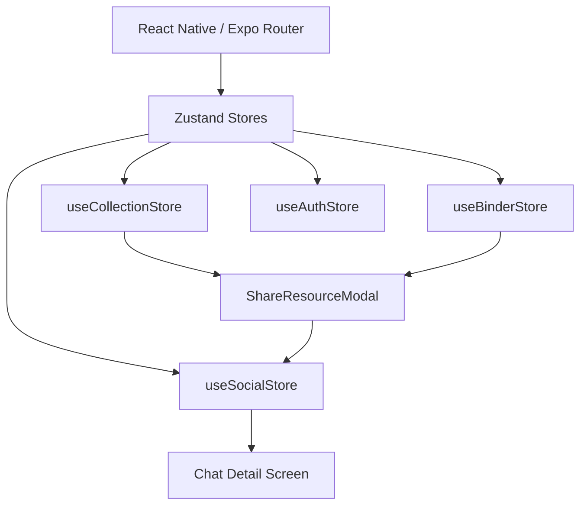

# Engineering Progress Report: Orchid Mobile (v6-Broken)

**Date:** February 3, 2026  
**Status:** MVP Iteration - Feature Complete for Social & Curation  
**Target Audience:** Senior Engineering Team

## Executive Summary
The Orchid Mobile application has transitioned from a basic brand browser to a multi-faceted curation and social platform. We have successfully implemented core "Folio" (Binder) management, expanded the "Collection" data layer, and introduced a "Social Space" that leverages the existing brand metadata for sharing.

---

## Technical Achievements

### 1. Robust Curation Architecture (Folios & Collections)
We have dual-layered the data management system to separate raw imports from curated selections.
- **Folio (Binder) System**: Implemented a standalone store (`useBinderStore`) for high-level curation.
- **Improved UX**: Added long-press context menus across Home and Collections screens using platform-native `ActionSheetIOS` and `Alert`.
- **Refined Interaction**: Centered Rename Modals with real-time character counting (20-char limit) and emoji support.

### 2. Social & Sharing Layer (Messages)
The legacy "Feed" has been replaced with a conversational interface designed for asset sharing.
- **Social Store**: A new `useSocialStore` manages conversation threading and message history.
- **Dynamic Attachments**: Messages support polymorphic attachments (`store`, `selection`, `collection`, `binder`), enabling users to share curated content effortlessly.
- **Interactive Messaging**: Bubble-based UI with status indicators and a dedicated `ShareResourceModal` for picking curation assets.

### 3. State Management & Reliability
- **Zustand Integration**: Clean separation of concerns between `useAuthStore`, `useUIStore`, `useBinderStore`, `useCollectionStore`, and `useSocialStore`.
- **Theme Resilience**: Implemented fallback mechanisms in the root layout to prevent crashes during guest authentication or theme switching.

---

## System Architecture Updates

---

## Current Obstacles & Challenges

### 1. Firestore Data Synchronization
Currently, much of the social and curation data is managed in persistent local state (Zustand + AsyncStorage). Transitioning to real-time Firestore sync will require:
- Complex merge conflict resolution for shared Folios.
- Pagination for large brand collections and long chat histories.

### 2. File Import Scalability
The `ImportModal` handles CSV/JSON imports. For senior review:
- **Challenge**: Large file imports (1000+ brands) currently block the JS thread.
- **Optimization**: Need to move parsing logic to a separate worker or optimize the store update batching.

### 3. Media Processing
- **Challenge**: The "Shared" badge and cover image containers are highly reliant on high-res URLs.
- **Need**: Implement more aggressive image caching and progressive loading to maintain the "Premium" feel on lower-end devices.

---

## Challenges Ahead (Roadmap)

1.  **Selection Sharing**: Implementing the "Share Selection" feature which allows multi-select within a list before sharing to a chat.
2.  **Collaborative Folios**: Real-time collaborative editing of "Shared Folios" (shared badges are currently UI-only).
3.  **Global Search**: A unified search interface that polls across Stores, Collections, and Messages.
4.  **Haptic Feedback Alignment**: Standardizing haptics across all long-press and destructive actions for consistent tactile feel.

---

## Engineering Feedback Required
- **Data Model**: Is the current separation of `StoreItem` vs `Collection` optimal for deep-linking?
- **Store Hydration**: Review the strategy for per-store hydration to ensure minimal boot time as the number of stores grows.

---
*End of Report*
